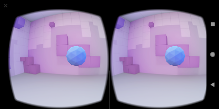

# vr-mosquito

这是清华大学虚拟现实技术课（2019秋季学期）第二次小作业的实验报告

## 目的

运用 HRTF 的方法生成不同位置处的3D音效，使用户得以听声辨位，寻找到目标物，透过此次项目理解 3D 音效的原理以及虚拟现实中生成立体音效的技术。任务的具体目标是在场景中随机生成目标物体，根据用户当前面向方向和物体相对位置生成对应的 3D 音效。

> 限制：禁止使用游戏引擎以及 OpenAL 之类的现成解决方案

## 实现

### 场景构造

google cardboard 的 SDK 中的 HelloVR 的场景基本上可以直接拿来用，HelloVR 是一个在房间中寻找目标物体的 Demo，因此只需要基于这个加上位置判断及 3D 音效即可。

指向目标物体变色以及点击后重新生成新的目标物体的功能来自于 HelloVR SDK，报告中不多做叙述。

### 声音生成

[这个开源库](https://github.com/Asues/Matlab/tree/master/HRTF)大致示范了如何对 CIPIC 的数据做卷积实现 3D 音效，我稍微修改了这个开源代码，对蚊子声做卷积，生成了 50 个不同方位的立体声效档，详细代码见`./HRTF`。

### 方向判断

在`onNewFrame`中判断当前用户面朝的方向和目标物体的位置关系，基于 SDK demo 的实现，目标物体的坐标存储在`targetPosition`中，而用户朝向则存储在我新定义的`float forwardVec[]` 中，透过调用`headTransform.getForwardVec`更新。

获得了这两个向量后就可以判断相对方位了，由于生成的 50 个音效实际上就是从左手边开始逆时针环绕用户一圈取五十个点的声源，并无考虑上下关系，因此不考虑垂直部分，用 x-z坐标计算二维向量的夹角，透过两个向量的內积确定绝对值，用外积确定正负即可。再将得到的角度映射到对应的声效文件编号。相关函数为`determinePos`，代码如下：

```java
    private int determinePos() {
        float f_x = forwardVec[0], f_z = forwardVec[2];
        float x = targetPosition[0], z = targetPosition[2];
        float theta = (float)Math.acos((f_x*x+f_z*z)/(Math.sqrt(f_x*f_x + f_z*f_z)* Math.sqrt(x*x + z*z)));
        float ratio = theta / 3.14159f;
        float cross_val = f_x*z - f_z*x;
        float step = 50.0f / 2.0f;
        boolean is_left = cross_val < 0.0f;
        // Log.i(TAG, "angle_"+ratio + "is left:" + is_left);
        if(is_left) {
            if(ratio >= 0.5f) {
                return (int)(1.0f + (ratio-0.5f) * step);
            }
            else {
                return (int)(37.0f + ratio * step);
            }
        }
        else {
            if(ratio >= 0.5f) {
                return (int)(13.0f + (1.0f - ratio) * step);
            }
            else {
                return (int)(25.0f + (0.5f - ratio) * step);
            }
        }
    }
```

### 立体声效加载

将生成的不同方位的立体声效文件放在`res/raw`中，使用 Android 的`MediaPlayer` 加载音频。由于 app 中开启过多`MediaPlayer`会被自动关闭，因此只使用一个`MediaPlayer`调用不同的音效，在初始化时预先加载50 个音频的描述符，之后在每次对应声效切换时根据描述符创建 MediaPlayer（原先指向的那个则释放资源）。另外，切换时先获取了原先播放到的毫秒数，切换后新的音频（即不同角度的立体声）从该毫秒数继续播放。

#### 用到的库与接口

MediaPlayer:

1. start()：播放。
2. create()：根据描述符创建新的 MediaPlayer 对象。
3. setLooping()：循环
4. setAudioStreamType()：设定流类型。
5. release()：释放原先占用的资源。
6. seekTo()：用来从指定的毫秒数开始播放

另外，在一开始使用`getResources.getIdentifier()`获取`res/raw`下各文件的描述符。

状态图如下：


## 结果



结果不运行有点难呈现，看图和 HelloVR 并无区别，新增的部分在于会根据球的相对位置会发出恼人的蚊子声，可以运行 SDK 体会。于 Pixel 2XL (Android 9.0) 上运行正常。

## 待改进之处

遇到的一个问题就是 mediaPlayer 在切换音频时会有短暂的卡顿，使用预先计算多个位置文件的方式的话这个卡顿是不可避免的，卡顿来自于`release`到 `MediaPlayer.create` 中 prepare 完这段时间。如果要更圆滑的过渡效果的话，需要在app 中计算卷积结果而非加载预处理结果。即为加分路线可采取的做法。