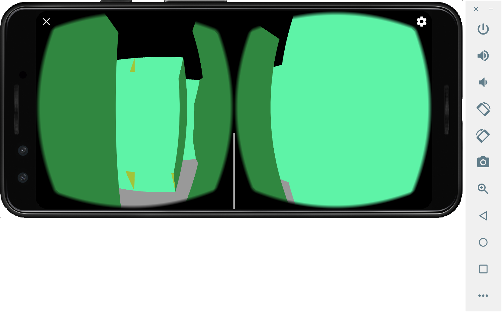

# 虚拟现实第一次课程作业：走迷宫

计 64 范轩玮 2016011334

## 开发环境

Android Studio

Pixel 3 虚拟机 (Android APK 26)

Google VR SDK 1.190

> 其实本来因为手机是 iPhone ，是打算使用 iOS 版本开发的。但是发现连官方示例都跑不起来，然后在 App Store 下载了几个 Cardboard 的 VR app 也全都是闪退，遂放弃转向 Android。

## 使用到的库

Google-vr-sdk/example/hellovrworld 中的相关函数，基于其进行重写。

GLES20：使用了 glDrawArrays, glDrawElements 等。

Matrix：使用 Matrix 计算multiPlyMM, setIdentity, setTransalteM 等常用的的矩阵操作。

## 实现流程

我先从官方示例 example 中的 HelloVrWorld 理解怎么构建一个 Cardboard 的 VR app，核心就是在 GvrActivity 的派生类中重写几个函数。和示例相比，比较大的不同是在迷宫里的移动以及场景的渲染。

### 渲染

HelloVrWorld 中是基于.obj 文件进行渲染的，这么做的好处是可以比较细致地定义各种好看的 3D 物件，贴图、纹理等美化工作也会比较到位。但是手动画出好看的 .obj 以及贴图是一件有点麻烦的事情，而根据迷宫动态渲染复数个同一个 .obj 又是一番功夫，因此我优先采用了比较 naive 的方式绘制图片：使用OpenGL 绘制基本的三角面片。

在 Triangle 类中我定义了绘制三角面片的基本操作以及属性，核心函数`draw()`接受一个 transform 矩阵来修正 movelViewProjection。在 Rectangle 类中定义了接受四个顶点绘制两个三角形的操作；而 Cube 类则是接受 4 个顶点以及柱高后绘制 6 个面。最终在迷宫类中透过 01 的二维数组来定义迷宫并规范起点，在数组为 1 的地方渲染出一个 Cube 即可。

### 移动

我的移动功能是透过修改 targetPosition 后重新计算 modelTargetView 实现的，并在 Maze 中维护一个用户当前指向，在 MainActivity 中的 onCardboardTrigger 里监听用户的操作，如果用戶当前指向允许移动（即前方没有墙），则让相应的 targetPosition 加/减一个Cube 宽度的距离，如此一来即可实现迷宫中的移动，而且并不需要判断碰撞。

但是我的移动功能实现的并不完全，因为并没有整明白怎么判断转动并作出相应的修正。

## 遇到的问题

这个作业比看起来困难上好多啊，主要是各种文档及背景知识的匮乏，Official Guide 基本只起到了教你怎么 run 起 demo 的功用，而就算看了 reference，其中也是诸多语焉不详。OpenGLES 也有类似的问题，明明是核心的 API，但是无论是官方文档还是示例代码都让人难以入手，即使在参考了博客以及其他资源后依然对于复杂的操作摸不着头绪。

此外，官方示例中使用的诸多 modelView 之类的成员变量在没有图形学的基础下是很难理解的，更遑论法线贴图等等，于是就有一种基于很好看的示例改出了丑丑的迷宫的感觉。

还有一点要吐槽的，无论是国内的网络还是外网上关于不带 Unity 的 Google VR SDK 的使用的资料都寥寥无几，极大地增加了做作业的难度。